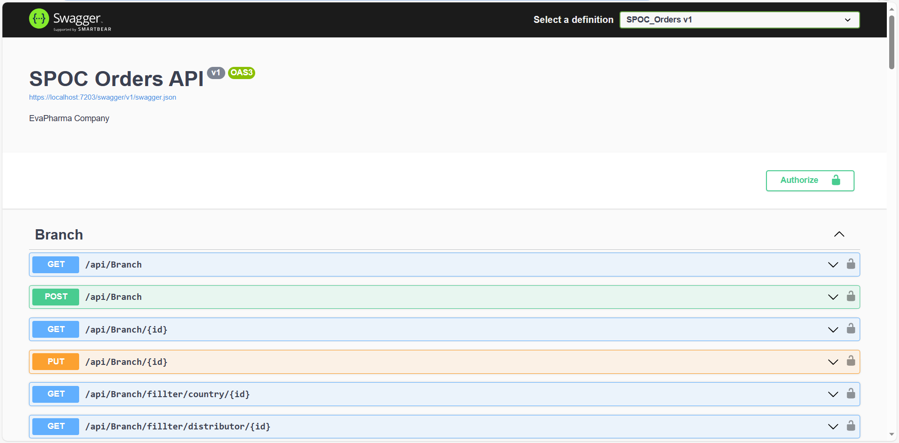

# SPOC_Orders
EvaPharma Project Help Med_Rep to Save Orders Between Pharmacies and Distributor Branches


## Project Purpose:

Spoc_Orders is a Web app that allows Save Orders By Med_Rep And Show These Orders Between Pharmacies and Distributor Branches. The site helps in the process of ordering between them and facilitates work on Med_Rep


## How to Load the App

The project uses Asp.Net CORE.  If you do not have .NET >= .7x installed, you can download it here: [.NET](https://dotnet.microsoft.com/en-us/download/dotnet/7.0)

Once .NET is installed, navigate to the directory where you want to save the app
```sh
git clone https://github.com/johnson3235/SPOC_Orders
```
You can Run it on ```Visual Studio 2022``` and use Nuget package manager to install dependencies.
### ```donet install``` 


A new browser window should automatically open displaying the app.  If it doesn't, navigate to [https://localhost:7203/](https://localhost:7203/) in your browser




